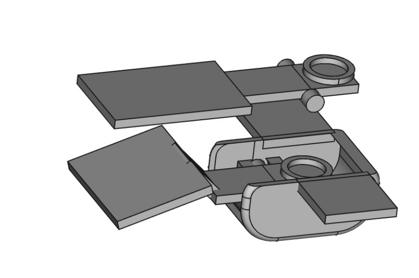

# stall_sensor_inav_plane
This is a Hall effect based stall sensor and aoa sensor for INAV or other RC planes.

You can use this as either stall sensor / stall horn (toggles on to indicate beginning of stall) or an AoA sensor (reads
current angle of attack).  For a stall sensor, use the lever named stall_sensor-lever-aoa and have it pointed forward.
Mount it on the bottom of the wing, recessed or flat. The sensing tab should clear the leading edge with just enough
clearance to move up and down, like a toggle switch. For an AoA sensor, use the flat lever and point it backward so it weathervanes.

Put a small magnet in the ring on the lever.  The lever will move up when the plane stalls, because the airflow at the
botom of the leading edge will be flowing up over the wing.

Mount an AH5303 or other Hall effect sensor on the printed part called "body", near the magnet. The sensor will detect when the magnet moves up and down past the sensor.  There are many tutorials on reading Hall effect sensors such as the AH5303 using Arduino or most any other platform.

